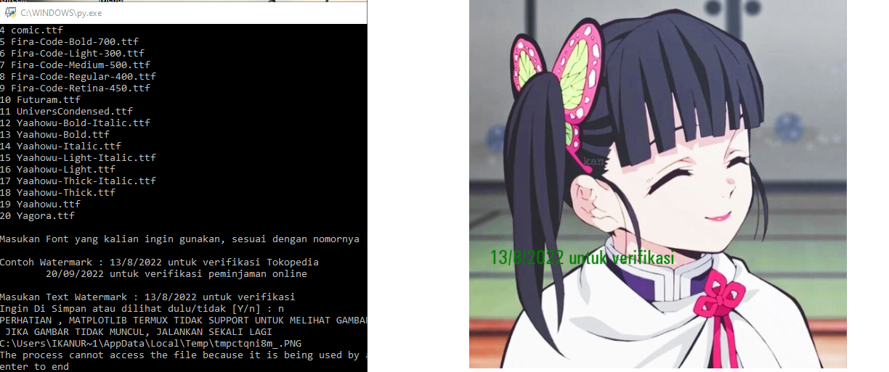
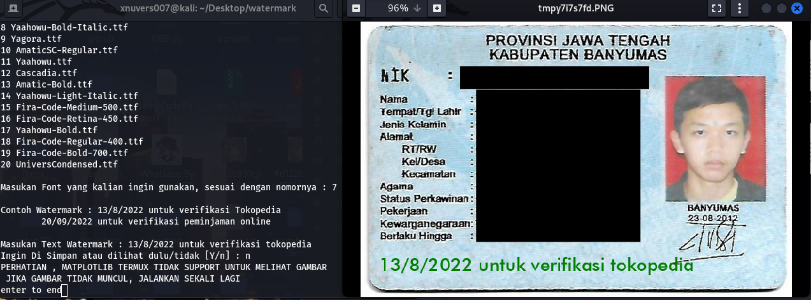

# information

ini adalah aplikasi untuk membuat watermark, bisa digunakan watermark ktp atau bisa juga digunakan watermark foto lainnya, ini berjalan hanya di sisi client, kalian bisa melhat saja isi kodenya [disini](./watermark.py)

note : sudah di test di <b>Windows 10, Kali Linux, Termux</b>

<b><i><u> Jangan pernah memindahkan Semuanya yang ada disini, nanti akan error, kecuali jika Anda Jago Pemrograman </u></i></b>

# penggunaan

download : [repositori ini](https://github.com/Xnuvers007/watermarkktp/archive/refs/heads/master.zip)

untuk pengguna windows, kalian download repository ini, jika kalian tidak mempunyai python, bisa [Menggunakan Ini](./Watermark.exe)

dan jika pengguna windows memiliki python, gunakan yang ini [watermark.py](./watermark.py)

untuk Pengguna Linux :
    - sudo apt install git
    - sudo apt install python3
    - git clone https://github.com/Xnuvers007/watermarkktp.git
    - cd watermarkktp
    - ./watermark.py

# Windows

hasilnya jika menggunakan windows

# Linux

hasilnya jika menggunakan Linux

# Copyright

<h1> © 2022 Xnuvers007 - All Rights Reserved. </h1>

